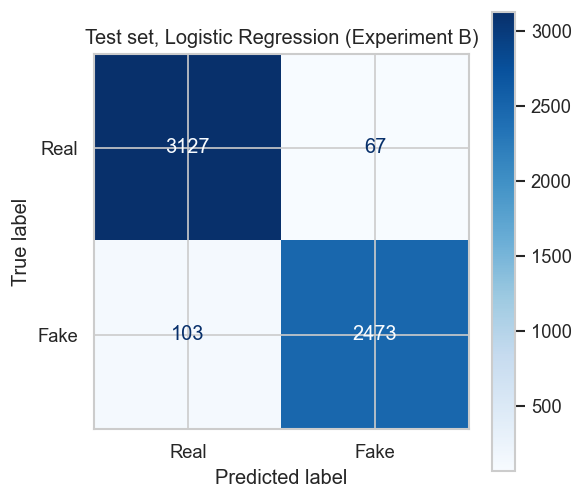
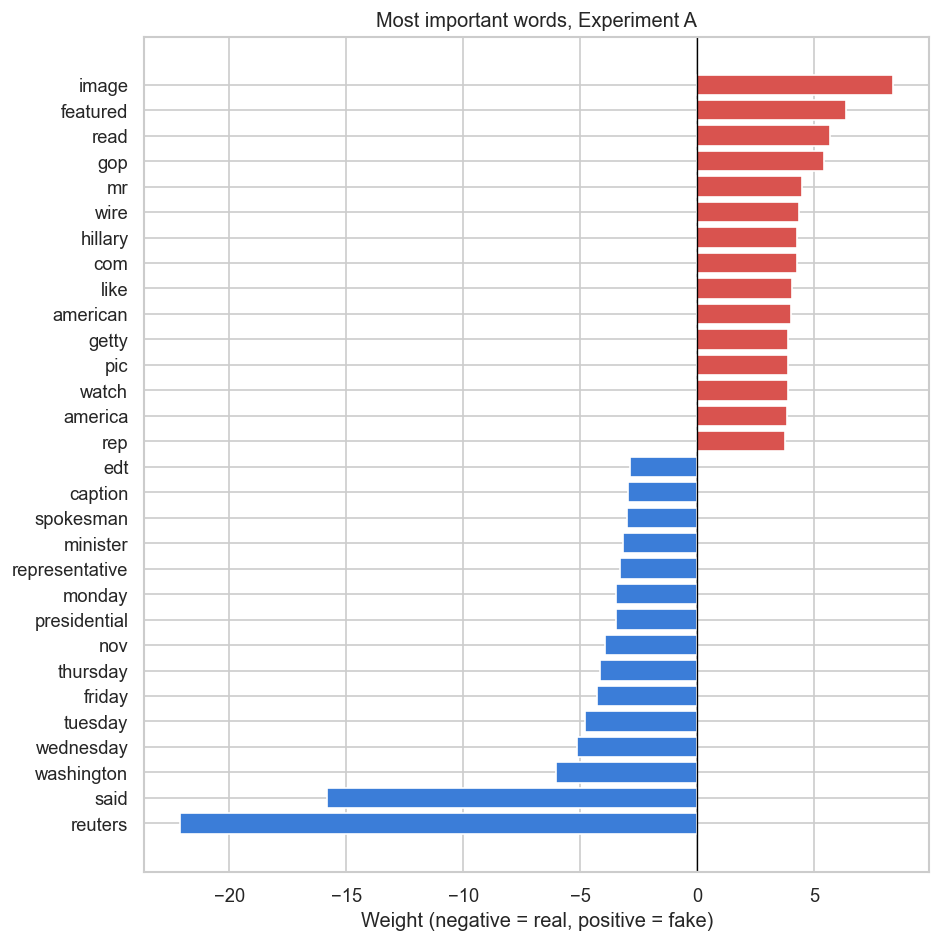
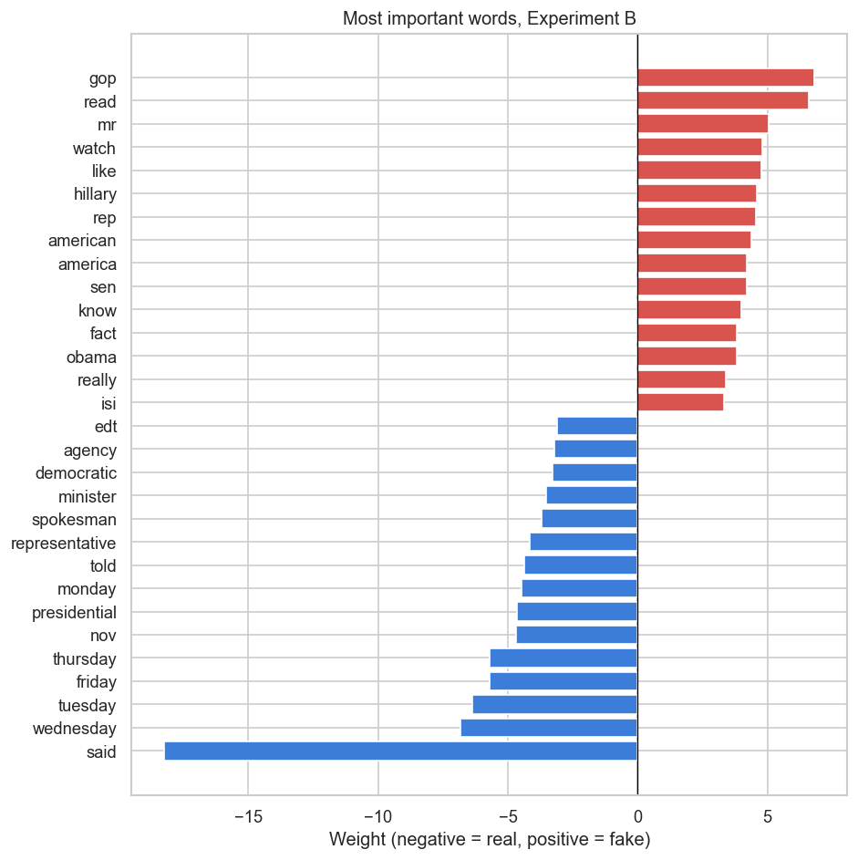

# Fake News Detection with NLP

A text classification pipeline that labels news articles as **real** or **fake**, built with Python, scikit-learn and NLTK. It combines a public Kaggle dataset with articles scraped from news and satire websites, compares two classic machine learning models, and checks whether the model learns the *content* of an article or only its *source*.

It also includes three small tools around the classifier: article summarization, sentiment analysis and a keyword search engine, plus a command-line chatbot that brings them together.

**Skills shown:** web scraping · text preprocessing · TF-IDF · Logistic Regression and Naive Bayes · model evaluation · data leakage analysis · Hugging Face Transformers · information retrieval

---

## Pipeline

```
Kaggle dataset ─┐
                ├─► clean & deduplicate ─► TF-IDF (5000 words) ─► Logistic Regression / Naive Bayes ─► evaluation
Web scraping ───┘          │
                           └─► remove source markers (Experiment B)
```

| Step | What happens |
|---|---|
| **Data** | [Fake and Real News Dataset](https://www.kaggle.com/datasets/clmentbisaillon/fake-and-real-news-dataset) (44,898 articles) plus 191 articles scraped from news sites (real) and satire / fake news sites (fake) |
| **Cleaning** | Remove empty articles and duplicates, remove URLs and punctuation, lowercase, remove stopwords, lemmatize |
| **Features** | TF-IDF, top 5000 words |
| **Models** | Logistic Regression, Multinomial Naive Bayes |
| **Split** | Stratified 70% training, 15% validation, 15% test |
| **Metrics** | Accuracy, precision, recall, F1 |

## Data

| | Real | Fake | Total |
|---|---|---|---|
| Kaggle dataset | 21,417 | 23,481 | 44,898 |
| Scraped (BBC, NPR / The Onion, Empire News) | 100 | 91 | 191 |
| **After removing empty articles and duplicates** | **21,288** | **17,172** | **38,460** |

Cleaning removed 1,131 empty or very short articles and **5,498 duplicates** (12% of the data). Without this step, copies of the same article can end up in both the training and the test set, which makes the test score look better than it is.

## Results

The Kaggle dataset has a known weakness: almost every real article starts with a Reuters dateline such as *"WASHINGTON (Reuters) -"*, and many fake articles end with image credits such as *"Featured image via Getty Images"*. A model can score very high just by spotting these markers. To measure this, the models are trained twice:

* **Experiment A:** on the cleaned text.
* **Experiment B:** after removing source markers (Reuters datelines, the word "Reuters", image credits).

**Validation set** (5,769 articles; precision, recall and F1 for the fake class):

| Experiment | Model | Accuracy | Precision | Recall | F1 |
|---|---|---|---|---|---|
| A: cleaned text | Logistic Regression | 97.9% | 98.4% | 96.9% | 97.7% |
| A: cleaned text | Multinomial Naive Bayes | 92.7% | 91.6% | 92.0% | 91.8% |
| B: source markers removed | **Logistic Regression** | 96.9% | 97.4% | 95.5% | 96.4% |
| B: source markers removed | Multinomial Naive Bayes | 91.8% | 90.4% | 91.2% | 90.8% |

**Test set** (5,769 articles, used once for the final model):

| Model | Accuracy | Precision | Recall | F1 |
|---|---|---|---|---|
| A: Logistic Regression | 98.3% | 98.3% | 97.9% | 98.1% |
| **B: Logistic Regression (final model)** | **97.1%** | **97.4%** | **96.1%** | **96.7%** |



### What the model really learned

The words with the largest weights show how the decision is made:

| Experiment A | Experiment B |
|---|---|
|  |  |

* In **Experiment A**, the strongest signal for real news is the single word **"reuters"**, and the strongest signals for fake news are **"image"** and **"featured"** from image credits. Those are markers of the source, not of the content.
* Removing them lowers accuracy by only about 1 point, so the model does use other information. But the top words in **Experiment B** are still mostly **writing style**: news-agency words such as "said", weekdays, "edt" and "spokesman" point to real news, while informal words such as "gop", "read", "watch" and "really" point to fake news.
* On the **36 scraped articles in the test set**, accuracy drops to **72%**, compared with **97%** on the Kaggle articles. The sample is small, but it shows that the model struggles with sources and topics it was not trained on.

**Conclusion:** the classifier is very good at telling Reuters-style reporting from the fake news sites in this dataset. It recognises writing style, not whether the facts are true, so the high score would not carry over directly to news in general.

## Extra tools

| Tool | How it works |
|---|---|
| **Summarization** | `sshleifer/distilbart-cnn-12-6`, a compact BART model fine-tuned on news |
| **Sentiment** | `distilbert-base-uncased-finetuned-sst-2-english` |
| **Search engine** | TF-IDF vectors and cosine similarity over all articles |
| **Chatbot** | `chatbot.py`: paste an article and get the prediction with its probability, a summary and the sentiment |

Example with a satirical article from The Onion (output from the first version of the project):

```
Article text: CHICAGO—As a singer made her way onto the field to kickoff another home game ...
Summary: White Sox public address announcer Gene Honda politely reminds fans to remove
         Polish sausages from mouths during national anthem.
Prediction: Fake
Sentiment: negative (86%)
```

## Run it yourself

```bash
git clone https://github.com/elmoussaouioumayma/fake-news-detection.git
cd fake-news-detection
pip install -r requirements.txt
jupyter notebook fake_news_detection.ipynb
```

* The dataset is downloaded automatically with `kagglehub`. If you already have `Fake.csv` and `True.csv`, set the environment variable `FAKE_NEWS_DATA_DIR` to their folder.
* Scraped articles are saved to `data/scraped_articles.csv` and reused on later runs. Set `RUN_SCRAPER = False` to use only the Kaggle data, which makes the results fully reproducible.
* Summarization and sentiment download about 1.5 GB of models. Set `RUN_TRANSFORMERS = False` to skip them.
* After the notebook has run, start the chatbot with `python chatbot.py` (or `python chatbot.py --no-extras` for the prediction only).

## Project structure

```
fake-news-detection/
├── fake_news_detection.ipynb   # full pipeline: data, cleaning, models, evaluation, tools
├── text_utils.py               # text cleaning shared by the notebook and the chatbot
├── chatbot.py                  # command-line chatbot
├── images/                     # figures used in this README
├── requirements.txt
└── LICENSE
```

The scraped data (`data/`) and the trained model (`models/`) are created when you run the notebook and are not stored in the repository.

## Limitations

* **Dataset bias.** Real and fake articles come from different sources and mostly cover US politics in 2016 and 2017, so the model learns the style of those sources (see "What the model really learned"). Removing source markers reduces this problem but does not remove it.
* **Satire is labelled fake.** Some scraped "fake" sites (for example The Onion) publish satire, which is not meant to deceive.
* **Small scraped set.** Only 191 articles were scraped (Reuters blocked the scraper, and two sites returned no articles), so the 72% on scraped test articles is based on just 36 articles. Website layouts change over time, so later runs will collect different articles.
* **Bag of words.** TF-IDF ignores word order and context, and the model judges writing style, not whether the facts are true.

## Possible next steps

* Fine-tune a transformer model such as DistilBERT or RoBERTa.
* Train and test on a dataset with many different sources and years, and keep whole sources out of the training set, to measure how well the model generalizes.
* Add explanations for single predictions, for example with LIME or SHAP.


## License

[MIT](LICENSE)
